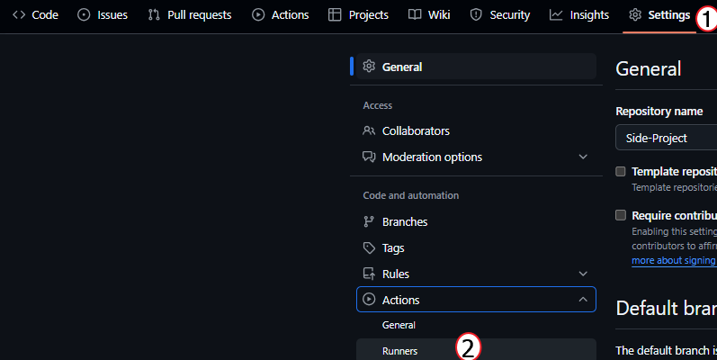

# 나 홀로 사이드 프로젝트

## 소개
* 해당 프로젝트는 데브옵스 엔지니어로서 필요한 기술 스택을 사용해보기 위해 진행하였습니다.
* 프로젝트의 주된 목표는 쿠버네티스 클러스터에 간단한 웹 어플리케이션을 배포할 CI/CD, 모니터링 및 로깅을 구축할 예정 입니다.
* Terraform과 Ansible 실행은 제 로컬 노트북의 WSL 환경에서 진행 할 예정 입니다.

## 기술스택
* 인프라: Kubernetes, Docker, Terraform, Ansible
* CI/CD: Github Action, ArgoCD
* 모니터링: Prometheus, Grafana
* 개발 언어: Go

## 목차
1. [환경 구성](./Step-1)
2. [웹 게시판 구현]()
3. [CI/CD 파이프라인 구성]()
4. [모니터링 및 로깅]()

## 기본 환경 설정
* Window에 WSL 설치
```sh
wsl --install
```

* Github Action Self-hosted 설치

Repository의 Settings -> Actions -> Runners


New-self-hosted runner 버튼 클릭 후 자신의 OS 환경에 맞춰 설치 진행


* Terraform 설치

* Ansible 설치