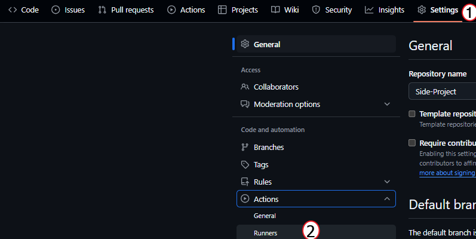

# Step-1

## 목표 
1. Terraform을 사용하여 클라우드(vSphere) 환경에서 가상머신을 생성
2. Ansible을 사용하여 생성된 가상머신에서 kubespray를 사용하여 k8s 클러스터 구축
3. Github Action을 사용해서 1,2번 내용을 한꺼번에 실행하도록 설정

## 사전 준비

우선, 저는 현재 사용하고 있는 Window 노트북에서 코드를 작성하고 실행 할 예정 입니다.

따라서 사전 준비 작업이 필요합니다.

## WSL 설치

* 명령 프롬프트 창을 열어서 아래의 명령어를 입력해줍니다.
```sh
wsl --install
```

## WSL 환경에서 Github Action 을 실행하기 위해 Self-hosted 설치

Repository의 Settings -> Actions -> Runners


New-self-hosted runner 버튼 클릭 후 자신의 OS 환경에 맞춰 설치 진행


## WSL 환경에 Terraform 설치

```sh
wget -O - https://apt.releases.hashicorp.com/gpg | sudo gpg --dearmor -o /usr/share/keyrings/hashicorp-archive-keyring.gpg
echo "deb [arch=$(dpkg --print-architecture) signed-by=/usr/share/keyrings/hashicorp-archive-keyring.gpg] https://apt.releases.hashicorp.com $(lsb_release -cs) main" | sudo tee /etc/apt/sources.list.d/hashicorp.list
sudo apt update && sudo apt install terraform
```

## WSL 환경에 Ansible 설치

```sh
sudo apt update
sudo apt install software-properties-common
sudo add-apt-repository --yes --update ppa:ansible/ansible
sudo apt install ansible
```

-----------

이제 부터 인프라 환경 구성을 해보도록 하겠습니다.

## 1. Terraform을 사용하여 vSphere 환경에서 가상머신을 생성

* 1-1. main.tf 에는 vCenter 접속 정보 및 데이터 소스를 정의 해줍니다.
* 1-2. 01_create_vm.tf 에는 가상머신을 생성하기 위해, 앞서 정의해둔 데이터 소스를 사용하여 가상머신의 스펙, IP 등을 정의 해줍니다.

## 2. Ansible을 사용하여 생성된 가상머신에서 kubespray를 사용하여 k8s 클러스터 구축

* 2-1. inventory.ini 에 그룹 별 호스트 정의
    * package 그룹 => kubespray를 사용하기 전 필요한 패키지 및 작업 진행 하기 위해 모든 호스트를 넣어줍니다.
    * master 그룹 => kubespray 실행은 master1 서버에서만 진행하기 때문에, master1 호스트만 넣어줍니다.

* 2-2. setup.yml 작성
    * 호스트 그룹 마다 Playbook이 실행 될 역할(role)과 태그 정의

* 2-3. 역할(role) 별 태스크 구성
    * package 태스크:
        * kubespray 설치 작업을 하기 전 SSH 접속을 Password로 하기 위해 sshpass 패키지를 설치 해줍니다.
        * 또한, 패키지 설치 시에 dpkg 잠금을 해결 하기 위해 unattended-upgrades 서비스와 apt-daily.timer를 종료 시켜줍니다.

    * master 태스크:
        * kubespray 실행하기 위한 사전 패키지 설치
        * kubespray 용 inventory.ini 설정
        * Container Runtime 설정
        * kubespray 실행