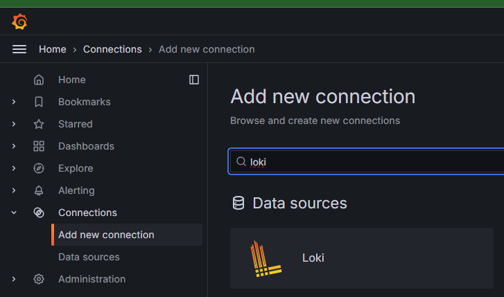

# Step-4

## 목표 
* Prometheus, Grafana를 설치하여 Web, Was 파드의 자원(CPU,Mem) 사용량 확인
* Loki, promtail을 설치하여 로그 시각화

## 1. Prometheus, Grafana 설치 (Helm 차트 사용)

* 1-1. Helm repo 추가

```sh
helm repo add prometheus-community https://prometheus-community.github.io/helm-charts
helm repo update
```

* 1-2. values.yaml 파일 내용 수정

저는 Grafana 대시보드에서 사용되는 admin 계정의 초기 패스워드와 외부 노출을 위해 Grafana의 서비스 타입을 변경하였습니다.

```sh
grafana:
  adminPassword: <원하는 패스워드>
  service:
    type: LoadBalancer
```

* 1-3. 설치

```sh
kubectl create namespace monitor
helm install monitor prometheus-community/kube-prometheus-stack -n monitor -f values.yaml 
```

## 2. Loki, promtail 설치 (Helm 차트 사용)

* 2-1. Helm repo 추가

```sh
helm repo add grafana https://grafana.github.io/helm-charts
helm repo update
```

* 2-2. 설치

```sh
helm install loki-stack grafana/loki-stack
```

* 2-3. Grafana의 Data sources에 Loki 추가

  * Grafana 대시보드 접속 -> Connections -> Add new connection -> loki 검색
  

