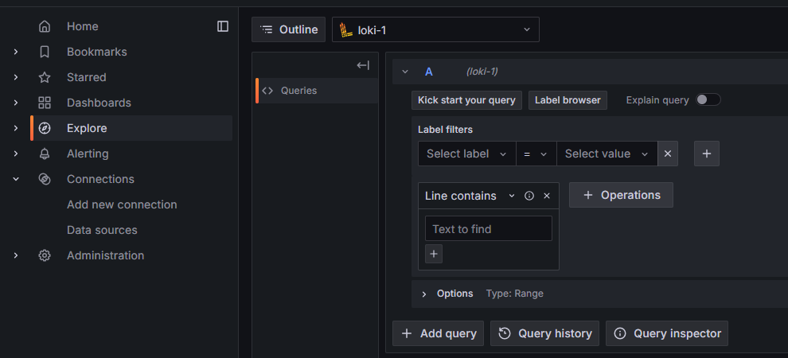

# Step-4

## 목표 
* Prometheus, Grafana를 설치하여 Web, Was 파드의 자원(CPU,Mem) 사용량 확인
* Loki, promtail을 설치하여 로그 시각화

## 1. Prometheus, Grafana 설치 (Helm 차트 사용)

* 1-1. Helm repo 추가

```sh
helm repo add prometheus-community https://prometheus-community.github.io/helm-charts
helm repo update
```

* 1-2. values.yaml 파일 내용 수정

저는 Grafana 대시보드에서 사용되는 admin 계정의 초기 패스워드와 외부 노출을 위해 Grafana의 서비스 타입을 변경하였습니다.

```sh
grafana:
  adminPassword: <원하는 패스워드>
  service:
    type: LoadBalancer
```

* 1-3. 설치

```sh
kubectl create namespace monitor
helm install monitor prometheus-community/kube-prometheus-stack -n monitor -f values.yaml 
```

## 2. Loki, promtail 설치 (Helm 차트 사용)

* 2-1. Helm repo 추가

```sh
helm repo add grafana https://grafana.github.io/helm-charts
helm repo update
```

* 2-2. 설치

```sh
helm install loki-stack grafana/loki-stack -n monitor
```

* 2-3. Grafana의 Data sources에 Loki 추가

  * Grafana 대시보드 접속 -> Connections -> Add new connection -> loki 검색

  

  * URL 입력해줍니다.

  

## 3. 대시보드 생성

* 3-1. 파드의 CPU, Mem 사용량 대시보드 생성

  * CPU 사용량(%) 확인하기 위한 쿼리
  ```sh
  sum by (pod) (((increase(container_cpu_usage_seconds_total{namespace="test"}[1m])) / 60) / 4 ) * 100
  ```

  해당 쿼리가 뜻하는 내용은, **test** 네임스페이스에 있는 POD 들이 실시간으로 사용하는 CPU 사용량(%)을 나타내는 쿼리 입니다.

  하나씩 살펴보면, `container_cpu_usage_seconds_total` 메트릭은 POD 안에 있는 컨테이너가 실행된 이후 사용한 총 CPU 시간을 초 단위로 저장하는 메트릭 입니다.

  그런데 여기서 `container_cpu_usage_seconds_total` 해당 메트릭을 그대로 사용하면 누적된 값이 계속 조회가 되기 때문에,

  `increase()`를 사용하여 1분 동안 증가한 값 / 60 을 하여 평균 값을 내고, POD가 동작하는 노드의 CPU Core 수로 나누기를 한 후에 100 을 곱해주어,

  POD의 실시간 CPU 사용량(%)을 집계 하였습니다.

    * Mem 사용량(%) 확인하기 위한 쿼리
    ```sh
    (container_memory_working_set_bytes{namespace="test"} / 8.3351e+9) * 100
    ```

    해당 쿼리가 뜻하는 내용은, **test** 네임스페이스에 있는 POD들이 실시간으로 사용하는 Mem  사용량(%)을 나타내는 쿼리 입니다.
    
    하나씩 살펴보면, `container_memory_working_set_bytes` 메트릭은 POD 안에 있는 컨테이너가 현재 사용 중인 실제 메모리 크기(바이트 단위)를 나타내는 메트릭 입니다.

    따라서 (해당 메트릭으로 수집한 Mem 사용량 / 노드의 Mem 양 (바이트 단위) ) * 100 을 통해 실시간 사용량(%)을 집계 하였습니다.


* 3-2. 파드의 log 대시보드 생성

  * 로그 대시보드 생성

  Grafana 접속 -> Explore -> data source를 loki로 선택 -> Select label을 POD로 선택 -> Select value 값에서 원하는 POD 선택
  
  